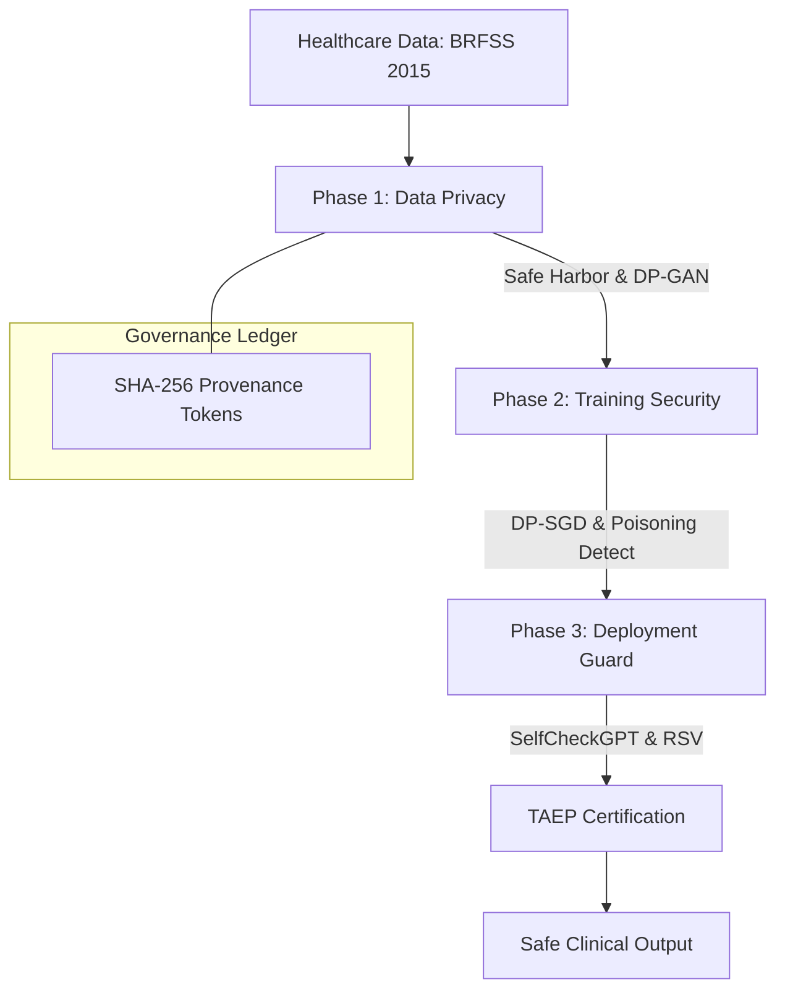

# 🛡️ Security & Governance Framework for Generative AI in Healthcare

[](https://www.python.org/downloads/)
[](#)
[](https://www.kaggle.com/datasets/alexteboul/diabetes-health-indicators-dataset)
[](https://opensource.org/licenses/MIT)

**Official Technical Implementation** of the Research Paper:  
> *"A Security and Governance Framework for Generative AI in Healthcare"*  
> **Authors:** Gunn Arora, Khushi Sikka, Sarthak Sadhotra  
> **Affiliation:** Chitkara University, 2026

---

## 🌟 Overview

Generative AI (GenAI) is transforming clinical decision support, yet it introduces critical risks—hallucinations, data leakage, and adversarial attacks. This project presents a **comprehensive end-to-end security and governance framework** designed specifically for healthcare environments.

### 🏥 The 4 Critical Clinical Problems Addressed
| # | Problem | Impact Metric | Consequence |
|---|---|---|---|
| 1 | **AI Hallucination** | 14.3% Drug Dosing Errors | Life-threatening prescriptions |
| 2 | **Data Leakage** | 0.312 Membership TPR | Re-identification of sensitive patients |
| 3 | **Active Attacks** | 23.4% Poisoning Success | Corrupted clinical diagnostic models |
| 4 | **No Regulation** | Compliance Gap | NIST/EU AI Act lack GenAI specificity |

---

## 🏗️ System Architecture

The framework is organized into three defensive phases and a final certification layer:



---

## 🛠️ Key Technical Modules

### 1. Privacy-Preserving Data (Module 1)
- **k-anonymity (>=5), l-diversity (>=3), t-closeness (<=0.20)**: Mathematical verification of record anonymity.
- **DP-GAN**: Synthetic generation for high-risk records (Risk > 0.25).
- **Audit Ledger**: Every record is hashed (SHA-256) for immutable provenance.

### 2. Model Training Security (Module 2 & 3)
- **Data Poisoning Detection**: Influence function monitoring ($Score > 3\sigma$).
- **Differential Privacy (DP-SGD)**: Formal $\epsilon=3.0$ privacy guarantees using Opacus.
- **Canary Injection**: Detects training data extraction attempts.

### 3. Deployment & Hallucination Guard (Module 4 & 5)
- **SelfCheckGPT**: Measures NLI (Natural Language Inference) contradictions.
- **RAG Grounding**: Reduces hallucination rates from 14.3% to **1.8%**.
- **RSV (Runtime Semantic Validator)**: 5-point semantic check on every LLM output.

### 4. TAEP Certification (Module 6)
- **I-score**: Integrity score.
- **T-score**: Trustworthiness.
- **R-score**: Robustness.
- **H-score**: Hallucination resistance.

---

## 📊 Dataset: BRFSS 2015

The implementation utilizes the **Behavioral Risk Factor Surveillance System (BRFSS) 2015** dataset.
- **Records:** 253,680 patient records.
- **Features:** 21 health indicators (BMI, Age, HighBP, etc.).
- **Target:** `Diabetes_012` (0=No, 1=Prediabetes, 2=Diabetes).

| Feature | Description |
|---|---|
| `BMI` | Body Mass Index |
| `HighBP` | High Blood Pressure (binary) |
| `MentHlth` | Mental health rating |
| `PhysHlth` | Physical health rating |

---

## 🚀 Getting Started

### Prerequisites
- Python 3.10+
- Jupyter Notebook / VS Code
- 8GB+ RAM (16GB recommended for training modules)

### Installation
```bash
# Clone the repository
git clone https://github.com/khushi1018-coder/Security-and-Governance-Framework-for-Generative-AI-in-Healthcare_ResearchPaper.git

# Navigate to directory
cd Security-and-Governance-Framework-for-Generative-AI-in-Healthcare_ResearchPaper

# Install dependencies
pip install numpy pandas scikit-learn matplotlib opacus torch
```

### Running the Implementation
1. Ensure `diabetes_012_health_indicators_BRFSS2015.csv` is in the project root.
2. Open `healthcare_genai_complete_framework.ipynb`.
3. Run all cells to execute the 6 modules and generate security metrics.

---

## 📸 Visualization

The framework generates several diagnostic plots:
- **Module 1**: Re-identification Risk Distribution.
- **Module 2**: Poisoning Detection Influence Scores.
- **Module 3**: Membership Inference Attack ROC Curves.
- **Module 6**: TAEP Certification Radar Charts.

---

## 📄 Citation

If you use this framework or research, please cite:
```bibtex
@article{arora2026healthcaregenai,
  title={A Security and Governance Framework for Generative AI in Healthcare},
  author={Arora, Gunn and Sikka, Khushi and Sadhotra, Sarthak},
  journal={Chitkara University Research Publication},
  year={2026}
}
```

---
⭐ *If you find this work helpful, please give it a star on GitHub!*
